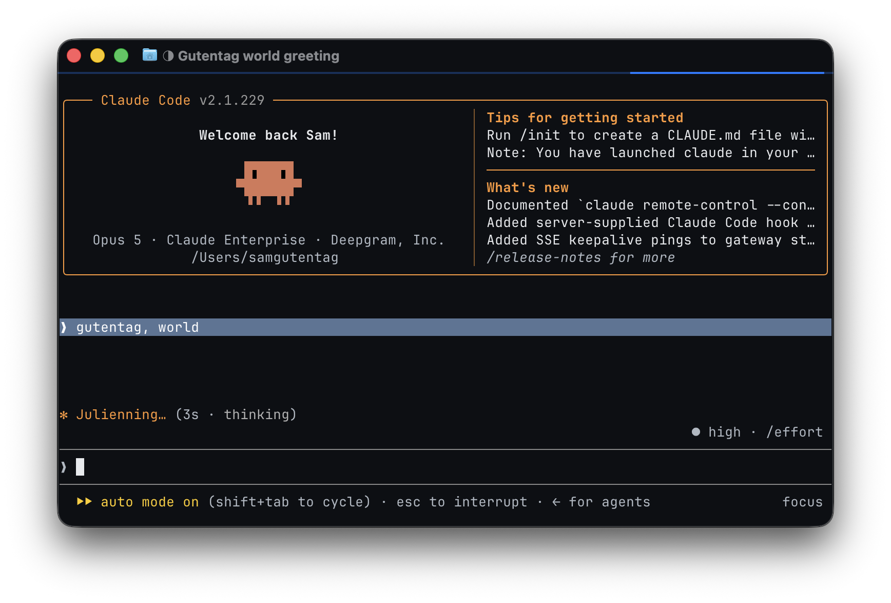

# claude-code-contrast

A measured high-contrast theme for Claude Code, plus the validator that proves it is actually high contrast.

In Claude Code's dark themes, the background block that separates your messages from Claude's renders at **1.18:1** against a default dark terminal background. That is imperceptible. This repo fixes it and gives you a way to check rather than squint.



<sub>After. The bar behind the user message is `#5a7596`. This shot was taken on a `#0d0f13` background so it shows 4.04:1; on pure black it is 4.42:1. [Before shot](screenshots/high-contrast-cb-before.png), for comparison, is the stock `#373737` at 1.18:1.</sub>

## The problem

Claude Code paints a background block behind your messages using the `userMessageBackground` theme token. In both dark themes that token is `rgb(55,55,55)`, or `#373737`.

| Terminal background | Contrast of the `#373737` block |
| --- | --- |
| Ghostty default, `#282c34` | **1.18:1** |
| VS Code dark+, `#1f1f1f` | 1.38:1 |
| Pure black, `#000000` | 1.76:1 |

WCAG's floor for a non-text UI element is 3:1. The text drawn *on* the block is fine at 11.90:1. It is the block-versus-terminal separation that fails, so the cue is not low quality, it is absent.

## Why the colorblind-friendly theme does not help

This is the part worth knowing. Diff `dark-daltonized` against plain `dark` and these tokens are byte-identical:

```
userMessageBackground   userMessageBackgroundHover   subtle   inactive   text
```

Every token that the daltonized theme actually changes is a **hue** substitution. So the theme labeled colorblind-friendly leaves untouched the one cue in the transcript that carries no hue information at all. If you cannot rely on the hue channel, the daltonized theme changes nothing about the hardest part of reading a transcript.

That is a luminance problem wearing a color problem's clothes, and it is why "switch to the colorblind theme" is not the answer.

## Install

**Start with your terminal's background color.** This is the step people skip, and it costs you about a third of the result. The theme is tuned for a near-black background. On a default Ghostty background you get 2.95:1 instead of 4.42:1, which is still 2.5x better than stock but not what this README advertises.

If you use Ghostty:

```
background = #000000
foreground = #e8eaed
minimum-contrast = 2
bold-is-bright = true
```

`minimum-contrast` forces foreground text below its threshold up to it, which catches dim output from other tools. Keep it at 2. Higher values start rewriting colors you chose deliberately. Note it does nothing for background-versus-background blocks, which is the actual bug here.

If you would rather keep your background, that is fine, just measure what you actually get:

```bash
./verify.py --bg '#282c34'    # your terminal's real background
```

Then the theme itself. Custom themes work today, though the mechanism is undocumented.

```bash
mkdir -p ~/.claude/themes
cp themes/high-contrast-cb.json ~/.claude/themes/
```

Set the theme in `~/.claude/settings.json`. The value is `custom:` plus the filename without `.json`:

```json
{ "theme": "custom:high-contrast-cb" }
```

Restart Claude Code. Themes are read at startup, so a running session will not pick up a new file.

## Verify

```bash
./verify.py --dichromat
```

```
PASS  userMessageBackground      #5a7596   4.42:1  (floor 4.0)
PASS  briefLabelYou              #8ecbff  12.14:1  (floor 7.0)
PASS  briefLabelClaude           #ffc14d  12.99:1  (floor 7.0)
PASS  subtle                     #7d8590   5.63:1  (floor 4.5)
PASS  inactive                   #b0b8c2  10.48:1  (floor 7.0)
PASS  your text on block         #ffffff   4.75:1  (floor 4.5)

label pair #8ecbff / #ffc14d under simulated color blindness:
  PASS  protan   #c2c2ff / #cdcd4c  deltaE  96.2  (floor 25.0)
  PASS  deutan   #babaff / #d8d846  deltaE 107.5  (floor 25.0)
  PASS  tritan   #81d3d3 / #ffb7b7  deltaE  54.2  (floor 25.0)
```

It reads the theme file itself, which matters: **Claude Code discards unrecognized override keys silently.** A typo does not error, it just quietly gives you worse contrast. The validator turns that into a `MISSING` line.

Useful flags:

```bash
./verify.py --bg '#282c34'          # measure against a different terminal background
./verify.py --theme path/to.json    # check someone else's theme
```

It exits non-zero on failure, so it works in CI or a pre-commit hook. If a Claude Code upgrade renames a token, this is what tells you.

## The ceiling

There is a hard limit on how far the block can go, and it is worth understanding before you retune it.

The block's foreground is the global `text` token. The renderer draws `text` over `userMessageBackground` and there is no separate token for the block's foreground. So every point of contrast the block gains against the terminal background is a point your own typed text loses against the block, at close to a one-for-one exchange.

| `userMessageBackground` | Block vs. background | Your text on block |
| --- | --- | --- |
| `#373737` (stock) | 1.76:1 | 11.90:1 |
| `#4f6b8e` | 3.83:1 | 5.49:1 |
| **`#5a7596`** (this theme) | **4.42:1** | **4.75:1** |
| `#63809f` | 5.12:1 | 4.10:1 |
| `#6c8aa8` | 5.84:1 | 3.60:1 |

`#5a7596` is the brightest value where both sides still clear 4.5:1. Past it you are trading the legibility of your own text for the visibility of the block. Measured against a pure black background.

## How the label pair was chosen

`briefLabelYou` and `briefLabelClaude` color the `You` and `Claude` labels. The stock daltonized pair is `#7ab4e8` and `#d77757`. This theme uses `#8ecbff` and `#ffc14d`, a blue against amber.

Blue versus amber is not a guess. Searching a grid of candidate colors that clear 7:1 against black, and scoring each pair by its **worst case** CIELAB separation across all three dichromacies, the best pair found scores 59.7 and this pair scores 54.2. Nearly tied on worst case, but this pair is far ahead where it counts:

| Pair | Protan | Deutan | Tritan | Worst |
| --- | --- | --- | --- | --- |
| `#8ecbff` / `#ffc14d` (this theme) | 96.2 | 107.5 | 54.2 | 54.2 |
| `#50d4d4` / `#d4a850` (best worst-case) | 59.7 | 72.6 | 60.4 | 59.7 |
| `#7ab4e8` / `#d77757` (stock daltonized) | 65.3 | 79.8 | 69.6 | 65.3 |

Protanopia and deuteranopia together affect roughly 8% of males. Tritanopia is on the order of 0.01%. Optimizing the common cases at a small cost to the rare one is the right trade, so blue and amber it is.

Simulation is Viénot 1999. It ranks candidates, it does not replace testing with actual colorblind readers.

**Caveat on the labels:** they only render when Claude Code's brief layout is active, which is gated behind `CLAUDE_CODE_BRIEF` or an off-by-default feature flag. In a default install you get the block and no labels, and the two are mutually exclusive. So the label colors here are a latent cue, correct for when that layout ships, not something you will see today.

## Theme file format

Undocumented, so recorded here.

```
~/.claude/themes/<slug>.json

{
  "name": "<display name shown in /theme>",
  "base": "dark | light | dark-daltonized | light-daltonized | dark-ansi | light-ansi",
  "overrides": { "<token>": "<color>", ... }
}
```

Activate with `"theme": "custom:<slug>"`. Accepted color formats are `#rrggbb`, `#rgb`, `rgb(r,g,b)`, `ansi256(0-255)`, and `ansi:<name>` for the sixteen standard slots. Anything else is discarded and the base value is kept.

There is also an interactive editor at `/theme` then <kbd>Ctrl</kbd>+<kbd>E</kbd>, with a live preview. Which tokens it exposes is unconfirmed, so the file is the deterministic path.

Tokens worth knowing:

| Token | Where it shows up |
| --- | --- |
| `userMessageBackground` | Block behind your messages. Also the conversation selector and Plugin/Skill/MCP badges. |
| `briefLabelYou` / `briefLabelClaude` | The `You` and `Claude` labels in brief layout. |
| `subtle` / `inactive` | De-emphasized text. Worst offenders after the block. |
| `text` / `inverseText` | Primary body text and its inverse. |
| `composerSidebarBackground` | Gutter beside the input composer. |
| `bashMessageBackgroundColor` | Block behind bash output. |
| `diffAdded` / `diffRemoved` | Diff backgrounds, green against red by default. |
| `success` / `error` / `warning` | Status colors. |

Dump the full list for your version:

```bash
strings -a "$(readlink -f "$(which claude)")" \
  | grep -oE '\{autoAccept:[^{}]*\}' | head -1 | tr ',' '\n'
```

## Fragility

Verified against **Claude Code 2.1.229**, Ghostty 1.3.1, macOS.

The custom theme mechanism is stable in that version but undocumented, which means token names are an internal detail and can be renamed without a changelog entry. Unknown keys fail silently. If contrast quietly regresses after an upgrade, run `./verify.py` first, then re-dump the token list and diff the names against the theme.

That is exactly why the validator is in this repo and not just the theme. Ship the check or don't ship.

## Upstream

Filed as [anthropics/claude-code#86221](https://github.com/anthropics/claude-code/issues/86221), which asks for a cue that is not a color at all (a left rule or gutter glyph), since that is the only fix with no ceiling.

If it lands, this repo becomes unnecessary, which is the goal.

## Contents

```
themes/high-contrast-cb.json   the theme
verify.py                      the validator, stdlib only
screenshots/                   before and after
```

Four files and two screenshots. `verify.py` needs no dependencies and no install step.

## License

MIT
